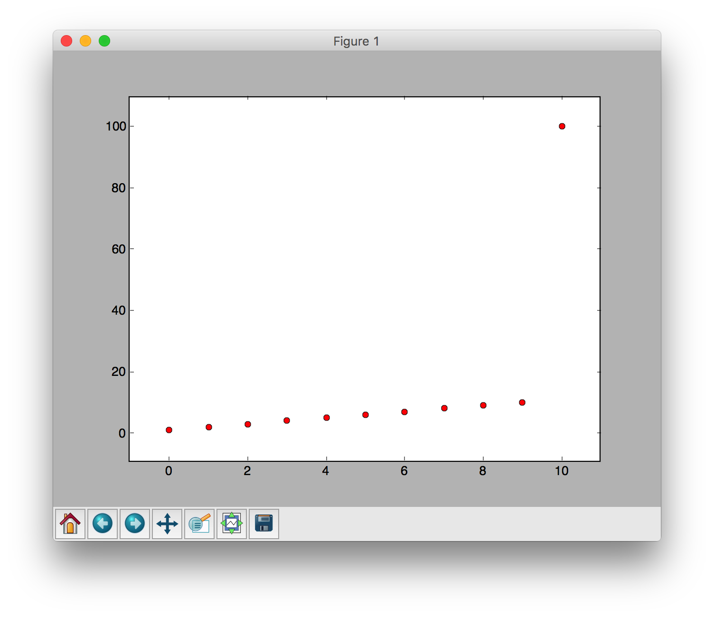

# 표준 편차를 구할 때 편차의 제곱을 이용하는 이유

### 개요
 표준 편차는 고등학교 확률과 통계 과정에서 상당한 비중을 차지 한다. 확률과 통계 문제를 푸는 과정에서도 무의식적으로 '표준 편차'라는 개념을 사용한다. 그렇다면 '표준 편차'라는 것은 어떤 의미를 가지는지, 표준 편차를 구하는 과정에 대해서 생각해보기로 하였다.
 표준 편차는 각 편차의 제곱의 평균을 구하게 된다.

 시중의 대부분의 문제집, 개념서에서는 표준 편차가 각각의 자료들이 평균에서 어느 정도 멀리 떨어져 있는지를 나타낸다고 한다.

 여기서 편차란, 각각의 값들과 전체 평균에 대한 차 이며, 이러한 여러 편차들을 대표하는 '산포도'이며, '산포도'는 '흩어져 있는 정도'를 의미한다.

 평균에 다양한 종류가 있듯이, 산포도에도 다양한 종류가 존재하는데, 그 중 가장 대표적인 것이 바로 표준 편차 이다.

 그런데 표준 편차는 편차의 제곱을 이용한다.

 이 부분에 대해 간략하게 조사하면, 편차는 어떠한 값과 전체 평균의 차이이므로, 음수가 존재할 수 있기 때문에 음수를 양수로 바꾸어주기 위해 편차의 제곱을 사용한다고 한다.

 여기서 한 가지 의문점이 생겼다.

> 단순히 편차의 값을 음수에서 양수로 바꾸기 위해서 제곱을 쓰는 것이라면, 절댓값을 사용해도 되지 않을까?

 이러한 의문점을 해결하고자 ***왜 표준 편차에서는 절대값 대신 편차의 제곱을 이용하는가*** 라는 주제로 탐구를 진행하기로 했다.

### 본론

#### 표준 편차

 본격적인 탐구에 앞서 표준 편차가 가지는 의미에 대해 먼저 조사하였다.

 자료가 나타내는 값들을 x1, x2, ...이라 하고, 그 평균을 m이라 한다면 표준편차의 정의는 다음과 같다.

 

 위의 경우에서 평균 편차는 다음과 같은 경우에 최솟값을 가지게 된다.

 

 따라서 표준 편차는 자료의 값들이 ***평균에*** 가까울 수록 흩어진 정도가 작음을 나타낸다.

#### 평균 편차

 위에서 언급한 바와 같이 표준 편차라는 것은 '산포도'의 한 종류이다.
 그리고 편차의 절대값을 이용하여 계산한 산포도를 평균 편차 라고 한다.

 평균 편차는 아래와 같은 식을 가지게 된다.

 

 또한, 아래와 같은경우에 최솟값을 가지게 된다.

 

 위 식에서 A가 x1, x2, ... 의 중앙값일때 g(A)가 최소가 된다.

 즉, 평균 편차는 표준 편차와 다르게 평균이 아닌 ***중앙값*** 에 가까운 정도를 나타내는 것이다.

#### 평균과 중앙값

 위에서 알 수 있듯이, 평균 편차와 표준 편차는 일차적으로 생각했을때 각각의 값들이 평균에서 떨어진 정도를 나타낸다고 생각할 수 있다.
 그러나 위 정의에서 알 수 있듯이 표준 편차는 평균에서 각각의 값들이 떨어진 정도를 나타내는 것이 맞지만, 평균 편차는 ***중앙값*** 에서 각각의 값들이 떨어진 정도를 나타낸다.  

 그렇다면 평균값과 중앙값의 차이는 무엇이며, 왜 표준 편차를 더 자주 사용하는 것일까?

 평균과 중앙값의 각각의 정의는 아래와 같다.

 평균

 

  > 산술 평균의 정의이며, 이것이 일반적으로 사용하는 평균이다.

 중앙값 : 어떤 주어진 값들을 크기의 순서대로 정렬했을 때 가장 중앙에 위치하는 값.

  확률 분포에서는, 실수 m이 아래의 식을 만족할 경우에 그 값을 확률분포 P의 중앙값이라고 한다.

 

 평균은 각각의 값들을 모두 더해 값들의 갯수로 나눈것이며, 중앙값은 단순히 각각의 값들을 정렬하여 가운데 위치하는 값을 선택한 것이다.
 일반적으로 생각했을때에는 별 차이가 없어보이지만, 극단적인 값이 존재할 때에는 평균은 극단적인 값을 반영하지만, 중앙값은 반영하지 못한다.

 예시)

 ~~~
 import numpy as np
import matplotlib.pyplot as plt

v = []
for i in range(1, 11):
   v.append(i)

print(v)

plt.plot(v, 'ro')
plt.show()

print(np.median(v))

print(np.average(v))
 ~~~

 

 위의 경우에서, 중앙값은 5.5, 평균은 5.5로 동일하다.

 그렇다면 극단적인 값이 추가되면 어떻게 될까?

~~~
v.append(100)
~~~

극단적으로 v 벡터에 100을 추가하였다.

~~~
print(np.median(v))

#중앙값
> 6.0

print(np.average(v))
#평균
> 14.0909090909

~~~

 극단적인 값을 추가한 결과, 중앙값은 6.0으로 거의 차이가 없지만, 평균은 14.0909090909으로, 큰 차이가 발생하였다.

 이를 통해 평균은 극단적인 값이 존재할 경우에 극단적인 값도 평균값에 반영하는 것임을 알 수 있다.

#### 표준 편차와 평균 편차

 위 경우에서 평균과 중앙값은 큰 차이를 보였다. 그렇다면 표준 편차와 평균 편차의 경우에는 어떠할까?

~~~
v1 = [1, 2, 3, 4, 5, 6, 7, 8, 9, 10]

v2 = [1, 2, 3, 4, 5, 6, 7, 8, 9, 10, 100]
~~~

v1 벡터는 균일한 데이터, v2는 극단적인 데이터가 추가된 경우이다.

각각의 데이터에 대해 표준 편차와 평균 편차를 구해보도록 하겠다.

* v1에 대한 결과

~~~
print(np.mean(v1)) #평균 편차

> 5.5

print(np.std(v1)) #표준 편차

> 2.87228132327
~~~

* v2에 대한 결과
~~~
print(np.mean(v2)) #평균 편차

> 14.0909090909

print(np.std(v2)) #표준 편차

> 27.3045269156
~~~

 위 결과와 같이 극단적인 값이 존재할 떄 표준 편차가 평균 편차에 비해 크게 변화함을 확인할 수 있다.

### 결론 및 느낀점

 '표준 편차에서는 왜 제곱을 사용하는가'에 대한 의문은 평균 편차와 표준 편차의 차이에새 해답을 얻을 수 있었으며, 평균 편차와 표준 차이는 평균과 중앙값의 차이에서 해답을 얻을 수 있었다. 또한, '왜 표준 편차를 집중적으로 사용하는가'에 대한 해답도 얻을 수 있었다.

 우리는 일반적으로 대표값으로 ***평균*** 을 사용한다. 대표값으로 제일 많이 사용하는 것이 평균이기 때문에 평균을 반영하는 표준 편차가 중요한 것이고, 평균 편차에 비해 많이 사용되는 것이다.

 다만, 위 경우와 같이 극단적인 값이 존재하는 경우에는 평균은 대표값의 의미를 상실하게 됨으로, 극단적인 값이 존재할 경우에는 대표값으로는 중앙값을 이용하고, 표준 편차보다는 평균 편차를 이용해야 할 것이다.

 물론, 현 교육 과정에서 제시되는 문제에는 극단적인 값이 존재하는 경우가 없으므로, 편차의 절댓값을 이용한 표준 편차를 사용하는것이 옳을 것이다.

 위 탐구 과정을 통해 통계 과목을 공부할때 배우는 표준 편차, 평균, 분산 등의 값이 무엇을 의미하는지에 대해 주의해야할 필요성을 느꼈다. 단순한 문제를 푸는 경우에는 무의식적으로 표준 편차를 사용하는것이 문제가 되지 않겠지만, 실제 현실의 문제를 해결할 때에는 데이터의 특성을 파악한 후에 대푯값으로 무엇을 이용할지에 대해 고민하는 과정이 필요하다고 느꼈다.
